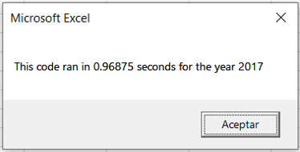
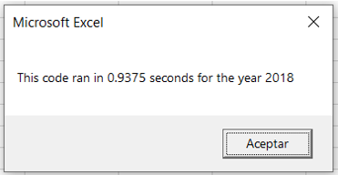

# VBA_Challenge
Challenge 2 - Stock Analysis, using macros VBA. Bootcamp

## Overview of Project
The analysis was a request for Steve. He wants to help his parents to make the better decision to invest their money. Steve ask for help. He has the data about the stock ticker of 2017 and 2018. The requirement is to calculate the volume and the return value for each stock of each year. This way, he can advise his parents on which stock is the best choice for investing. The best approach to make this possible is to build a macro for analyzing the data in a short time and a minimum effort for him. We develop a good solution, but the processing data time is high. We need to refactor our code to cut down the processing data time.

## Results about analysis of the stock: 

The analysis of the stocks in 2017 and 2018 gives these results.

#### 2017

#### 2018

The stock ENPH (Enphase Energy Inc) is a good shot. In 2017 has a return of about 129% and in 2018 of 82%. It was one of the two stocks that has a positive return in 2018. In both years, 2017 and 2018, the stock ENPH has a return of above 80% even in 2018 when almost all stock has a negative return.

## Results about reduce processing data time

In our first approach, we use interaction to search a defined stock ticker name in a database and get the volume, starting price, and ending price, and add the values in the variables every time that the name of the stock ticker is finding it. The code runs over and over with every id of the stock ticker of the dataset has.

#### ID tickers Array

This is the list of the ticker's names that the machine will be looking for. 

#### First solution

The interaction is looking for just one name and passes through the whole dataset. This searching has to finish for starting a new search with a different name.

The time in the data processing was:

  
#### Refactored solution

To improve processing times, the changes were made was to add three more arrays to the solutions.

And change the interaction, now the interaction read any name of the stock ticker, and identify the index value in the array, then add the value of volume, starting price, ending price in the same index depending on the array variable. The interaction only passes once over the dataset. These changes help us to save time.

The time in the data processing with these changes improved:

## Summary: 
The advantages of refactoring code are that it's possible to improve the processing data time, write fewer lines of code and create clean solutions.  The disadvantage of refactoring code is this task takes more time to think, plan, and design the solution. In the challenge, the processing data time was improved notoriously. It's possible to add more names of stock tickers without a lot of changes in the code. The code is easy to read and understand. It takes time to refactor the code, but it's worth it. The use of the other types of data helps to create new ways to do things faster and better. We need to think always out of the box.

