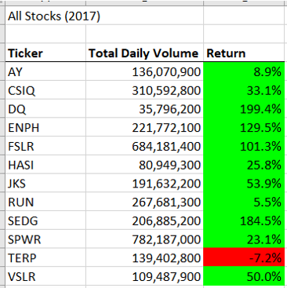
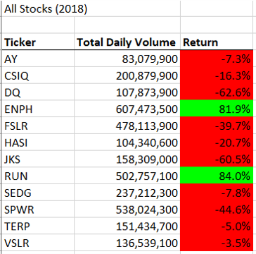
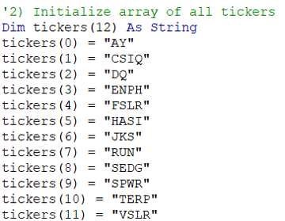
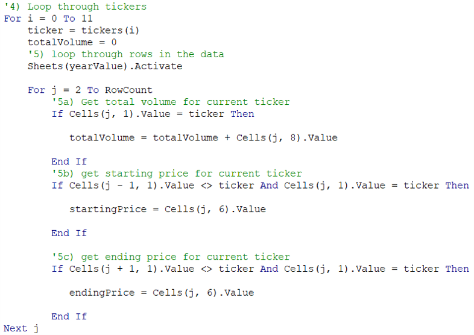
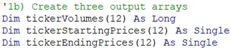
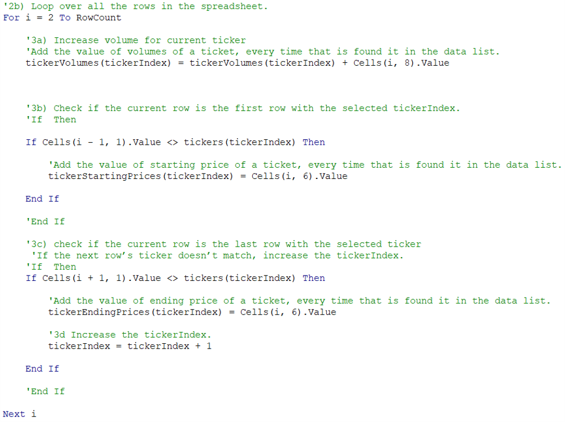
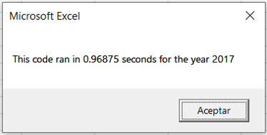
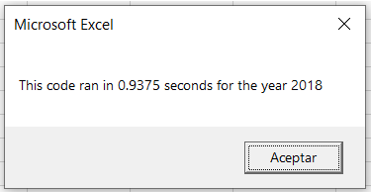
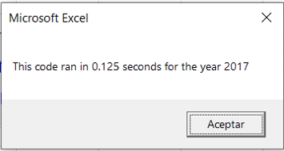
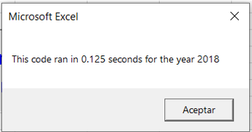

# VBA_Challenge
Challenge 2 - Stock Analysis, using macros VBA. Bootcamp

## Overview of Project
The analysis was a request for Steve. He wants to help his parents to make the better decision to invest their money. Steve ask for help. He has the data about the stock ticker of 2017 and 2018. The requirement is to calculate the volume and the return value for each stock of each year. This way, he can advise his parents on which stock is the best choice for investing. The best approach to make this possible is to build a macro for analyzing the data in a short time and a minimum effort for him. We develop a good solution, but the processing data time is high. We need to refactor our code to cut down the processing data time.

## Results: 

The analysis of the stocks in 2017 and 2018 gives these results.

#### 2017

#### 2018

In our first approach, we use interaction to search a defined stock ticker name in a database and get the volume, starting price, and ending price, and add the values in the variables every time that the name of the stock ticker is finding it. The code runs over and over with every id of the stock ticker of the dataset has.

#### ID tickers Array

This is the list of the ticker's names that the machine will be looking for. 

#### First solution

The interaction is looking for just one name and passes through the whole dataset. This searching has to finish for starting a new search with a different name.

  
#### Refactored solution

First, we have to add three more arrays to the solutions.

The interaction read any name of the stock ticker, and identify the index value in the array, then add the value of volume, starting price, ending price in the same index depending on the array variable. The interaction only passes once over the dataset. These changes help us to save time.

Using images and examples of your code, compare the stock performance between 2017 and 2018, as well as the execution times of the original script and the refactored script.

## Summary: In a summary statement, address the following questions.
What are the advantages or disadvantages of refactoring code?
How do these pros and cons apply to refactoring the original VBA script?

